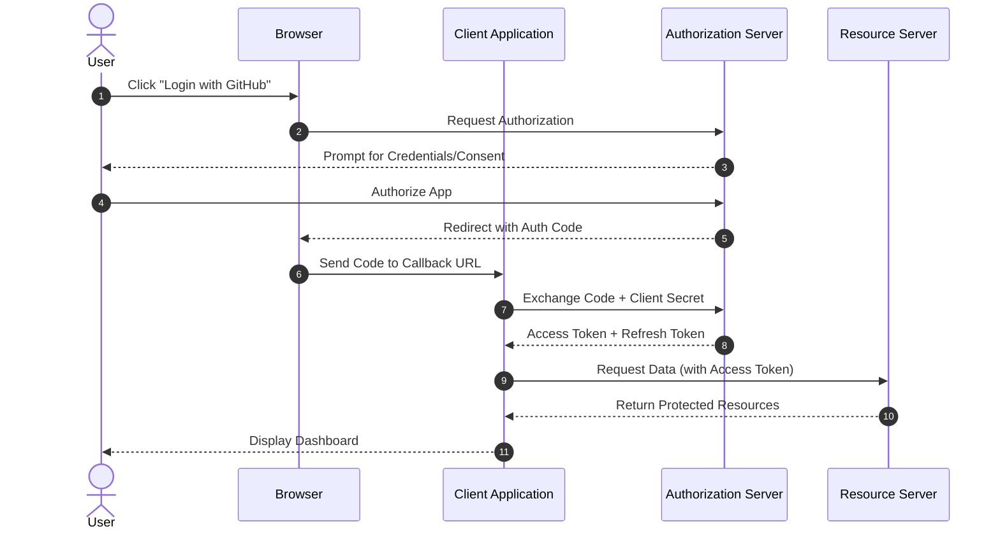

# Backend

# OAUTH-SECURITY-KEYCLOAK project
- Auth server as Keycloak
- Authorization code Oauth flow based project was designed
- Role mapping also based can access the API's

```mermaid
sequenceDiagram
    autonumber
    actor User
    participant Browser
    participant App as Client Application
    participant Auth as Authorization Server
    participant API as Resource Server

    User->>Browser: Click "Login with GitHub"
    Browser->>Auth: Request Authorization
    Auth-->>User: Prompt for Credentials/Consent
    User->>Auth: Authorize App
    Auth-->>Browser: Redirect with Auth Code
    Browser->>App: Send Code to Callback URL
    App->>Auth: Exchange Code + Client Secret
    Auth-->>App: Access Token + Refresh Token
    App->>API: Request Data (with Access Token)
    API-->>App: Return Protected Resources
    App-->>User: Display Dashboard
```
